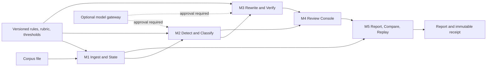

# Day 1: Map

## Sprint question

Can an AI quality lead import a representative corpus, distinguish harmful from legitimate negative parallelism, review meaning-preserving alternatives, and reach a traceable release decision faster than unaided review?

## Numbered customer story

1. The quality lead creates a local project and sees external inference disabled.
2. They map JSONL/CSV fields and dry-run validation. **FR1, FR12**
3. The system normalizes the corpus, fingerprints configuration, and returns an existing successful receipt for an identical run. **FR2**
4. Versioned rules flag candidate spans with offsets and matched evidence. **FR3**
5. The context judge labels each candidate `harmful`, `legitimate`, or `uncertain`, with bounded rationale. **FR4**
6. Harmful or reviewer-selected candidates receive two constrained alternatives. **FR5**
7. Deterministic and semantic checks block candidates that change protected facts, retain the target pattern, or create corpus-level repetition. **FR6**
8. The lead reviews original context, evidence, alternatives, and metric deltas; they accept, edit, reject, or defer. **FR7**
9. The system appends reviewer events and promotes adjudicated edge cases into a versioned replay proposal. **FR10**
10. The lead pauses, resumes, cancels, exports, or retries a failed stage without losing prior decisions. **FR11**
11. A report exposes item-level evidence, aggregate metrics, unresolved cases, and an approval control. **FR8**
12. The lead compares compatible baseline and candidate runs on the same item set. **FR9**
13. A named human records the release decision; the system emits a receipt and never publishes content. **FR2, FR8, FR12**

## Architecture sketch

## Canonical data schemas

All JSON objects include `schema_version`, `run_id`, `created_at`, `producer_version`, `input_hash`, and `status`.

| Artifact | Required payload |
|---|---|
| `RunManifest` | corpus hash, configuration hash, field map, ruleset/rubric/threshold versions, model destinations, cost cap, consent flags |
| `NormalizedItem` | item_id, text, optional context/prompt/model metadata, source row reference |
| `CandidateRecord` | item_id, candidate_id, sentence/span offsets, matched rule, evidence text, context window |
| `ClassificationRecord` | candidate_id, label, confidence, rationale, evidence offsets, classifier identity |
| `RewriteRecord` | candidate_id, rewrite_id, text, protected facts, generator identity |
| `VerificationRecord` | rewrite_id, check results, blocking reasons, metric deltas, verifier identity |
| `ReviewEvent` | candidate/rewrite artifact hashes, operator ID, decision, optional edited text, prior-event hash |
| `RunSummary` | exact denominators, incidence, agreement, acceptance, fidelity failures, repetition shift, unresolved counts |
| `RunReceipt` | manifest hash, all artifact hashes, approval event, invalidation status |

## External boundaries

- Local filesystem: read explicitly selected corpus; write only within the project run directory.
- Optional model gateway: accepts redacted bounded context; disabled until destination and retention approval.
- Authentication: prototype uses a local named reviewer identity; production identity provider is deferred.
- No model-weight, streaming-token, publication, or training API.

## FR disposition and gate

| FR | Journey step | Module | Status |
|---|---:|---|---|
| FR1 | 2 | M1 | Mapped |
| FR2 | 3, 13 | M1/M5 | Mapped |
| FR3 | 4 | M2 | Mapped |
| FR4 | 5 | M2 | Mapped |
| FR5 | 6 | M3 | Mapped |
| FR6 | 7 | M3 | Mapped |
| FR7 | 8 | M4 | Mapped |
| FR8 | 11, 13 | M5 | Mapped |
| FR9 | 12 | M5 | Mapped |
| FR10 | 9 | M5 | Mapped |
| FR11 | 10 | M1/M4 | Mapped |
| FR12 | 1, 2, 13 | M1/M4 | Mapped |

**Gate result: PASS.** All 12 FRs appear in the journey and have an owning module.
